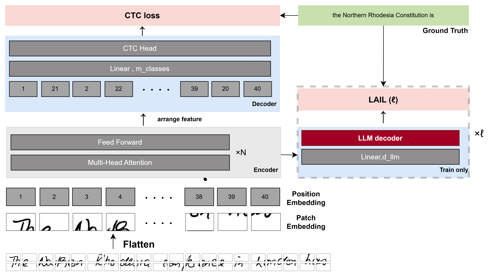



# 手書き文字認識モデルエンコーダへの言語特徴付与による有効性  
工藤滉青

---

## プロジェクト概要

手書き文字認識（HTR）の研究用コードとデータをまとめたリポジトリです。  
学習コードは `src/` 配下にあります。実行方法や環境構築は [`src/README.md`](./src/README.md)  を参照してください。

---

## 研究概要

### 背景・問題意識
手書き文字認識（HTR）では、画像を扱うエンコーダが **視覚特徴に強く依存**しやすく、字形が曖昧・欠損している場合に誤認識が生じやすい。一般的には、CTC出力に対して外部言語モデルを用いたデコードで文の整合性を補うが、これは推論時補正が中心であり、学習段階でエンコーダ表現へ十分に言語知識が反映されにくい。

### 目的
エンコーダ自体に **言語的整合性（語彙・構文）**を学習させ、字形曖昧・欠損に対しても頑健な表現を獲得させることで、認識精度（CER）を向上させる。

### 提案手法
ベースモデルとして、TrOCRのエンコーダを用い、デコーダをCTCに置き換えた **TrOCR-CTC** を採用する（言語制約の弱いCTCにより、言語知識注入の寄与を分離して評価しやすい）。  
提案手法では、TrOCRエンコーダの **複数の中間層出力** にコネクタ層を接続し、特徴をLLM（Llama3）の埋め込み空間へ写像する。凍結したLLMに入力し、正解文字列に対する **LAIL**を中間損失として計算することで、エンコーダが文字識別に加えて文脈整合性も反映した表現を学習するよう促す。  
モデル 構成図は以下の通り。

  

---

## 損失関数

学習は、CTC損失とLLM由来の中間損失（LAIL）を併用する。

- 全体損失：  
  L_total = L_CTC + α * L_LAIL
- LAIL：複数層から得るCLM損失の（層ごとの重み付き）和として定義

---

## データセット・評価

- データセット：IAM（Aachen split）
  - 学習 6,161枚 / 検証 966枚 / テスト 2,915枚
  - 文字クラス数：79
  - 657名の筆者（検証とテストに同一筆者が入らないよう分割）
- 入力前処理・画像設定：
  - データセット情報として画像サイズ 高さ384px・幅2048px
- 評価指標：CER = (S + D + I) / N

---

## 実験設定（主要パラメータ）

- バッチサイズ：4
- 学習率：1e-4
- 使用LLM：Llama3
- α（LAIL重み）：0.01

---

## 結果（要点）

### 表1：ベースライン vs 提案手法（CER）

| モデル | 損失 | CER (%) |
|---|---|---:|
| Baseline（TrOCR-CTC） | CTCのみ | 13.64 |
| Our Method | CTC + LAIL | **10.77** |

### 表2：コネクタ層の配置比較（接続するエンコーダ層 → CER）

| 接続層（例） | CER (%) |
|---|---:|
| 10,11,12 | 12.54 |
| 4,8,12 | 11.96 |
| 3,12 | 12.55 |
| 6,12 | 13.16 |
| 11,12 | **10.77 ** |
| 12 | 12.44 |

### 表3：LLMサイズ差（パラメータ数 → CER）

| LLMパラメータ数 | CER (%) |
|---|---:|
| 1B | 12.44 |
| 3B | 12.66 |

追加実験より、以下が示唆された：
- **コネクタ層の配置（どの中間層から接続するか）** が性能に大きく影響する
- **LLMのサイズ／接続数が大きすぎる**と、エンコーダ側が学習しきれず性能が悪化する傾向がある

---

## 結論

LLMに基づく中間損失を導入して学習段階から言語知識を注入することで、HTRの認識性能を改善できた。今後はコネクタ層設計の最適化と、他データセットへの汎化性能評価を行う。
